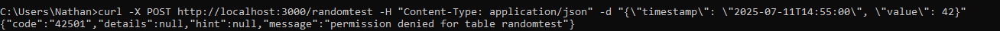

# The Concept

The goal for this project is fairly simple. I want to create a database, with accompanying embedded and web-application, to practice my skills in these fields, alongside expanding my knowledge into REST API's. The database will consist of two tables, one which contains random values, while the other contains actual weather data gathered from a sensor. It's been a bit since I last worked with fullstack development, and most of my experience came from Entity Framework, MariaDB and MVC.

## Databases - Been a while, crocodile

Let's start by making sure that once the system is all up and running, we can actually store and retrieve the data. This means setting up a database, alongside some form of REST API. After doing some research related to the different databases available, I decided to take a peek at [postgresSQL](https://www.postgresql.org/). This is an object-relational database, which would be useful in future projects, and the relationships would make more sense in complex code projects for me, especially since my experience with MariaDB was less than stellar in the past.

Once I installed postgresSQL, and creating a new schema (the internal name for table), I setup the columns with a timezoned timestamp, to act as my primary key, while the value column would be a random value. I did discover the `smallint` variable later, but I was a bit further into the project by that stage and was not planning on changing it. I did end up applying it to the weather schema though.


With some basic columns setup, it was time to take a peek at making a REST API. My knowledge, at least starting this project, was that REST API's required a lot of manual routing. Turns out, there are programs that actually do **all the work for you**, provided you configured your schema with some modicum of care, like [POSTREST](https://docs.postgrest.org/en/v13/). Alternatively, I could have used something like [Django](https://www.djangoproject.com/) or [Node JS](https://nodejs.org/en), but I opted to spare myself some tedium and focus on integration, rather than hard-coded development.

POSTREST works by taking your database as the source of truth for **everything**. Defaults, permissions and any other configuration that would usually be handled externally via controllers, now stems explicitly from the database. Less work for me, while still helping me remember a few things. With that in mind, I decided to setup some basic permissions for my database. I experimented with some permissions, even creating an API key in the end for use in some tests, but ended up going easy on myself and simply giving anonymous users read and insert permissions.


*No permission to post. Working as intended.*

Requesting **all** the data in the database went well, and gave me this giant JSON array:

*All the data! Never mind the fact it's randomly generated...*

Well, as it turns out, I forgot to add some defaults, resulting in my timestamp being non-existent for my first attempt at using `curl -X POST http://localhost:3000/randomtest`.

*Ah, yes, a time of NULL*

As it turns out, for timestamps, you can actually just set the default timestamp as `TIMESTAMP_NOW()`, after which it will just insert the current timestamp. Neat. One call of `curl` later with a valid payload:

*And fixed it. I did remove the null entry later via SQL Query.*

For any wayward adventurers, this ended up being the setup I used.

| Name     | Description                     | Command                     |
| -------- | ------------------------------- | --------------------------- |
| PGAdmin4 | GUI interface for DB management | NA                          |
| PSQL     | Server application              | `psql -U postgres -d APIDB` |
| POSTREST | REST API over POSTGRESSQL       | `postgrest restapi.conf`    |

I frequently just opted to use `PGAdmin4` and `POSTREST`, as `PGAdmin4` already opened a server internally for me. PSQL would be used if I were to host this on Amazon Web Services or Docker.

## Desktop Applications - Dusting off WinForms

After finishing and testing the database, I opted to create a little program to do some API calls in C#, as well as having a more user friendly interface for reading and inserting data into the random schema. Sadly, there wasn't much to note here, as it was all fairly straight forward after having typed out `curl -X POST http://localhost:3000/randomtest -H "Content-Type: application/json" -d "{\"value\": \"42\"}` often enough for my fingers to move on their own at a certain stage.

Setting up the connection:

```csharp
_httpClient = new HttpClient
{
	BaseAddress = new Uri(tB_URL.Text + tB_Database.Text) // Configurable values
};

_httpClient.DefaultRequestHeaders.Accept.Add(
new MediaTypeWithQualityHeaderValue("application/json"));
```

Getting the data from the database:

```csharp
HttpResponseMessage msg = _httpClient.GetAsync("").Result;
string[] data = msg.Content.ReadAsStringAsync().Result.Split('\n');
```

And finally, sending the data:

```csharp
using (StringContent stringContent = new StringContent
	(JsonSerializer.Serialize(new
		{
			value = _random.Next() % 10
		}),
		Encoding.UTF8,
		"application/json"))
{
	HttpResponseMessage response = await _httpClient.PostAsync("", stringContent);
	
	if (!response.IsSuccessStatusCode)
	{
		MessageBox.Show("POST request failed!", "Failure to setup request",
		MessageBoxButtons.OK, MessageBoxIcon.Error);
		return;
	}
	
	MessageBox.Show("POST request succeeded!", "Successfully setup request",
	MessageBoxButtons.OK, MessageBoxIcon.Information);
}
```

With some help from my good old friend `WinForm`, this game me this lovely little application:


## Embedded - ESP32 my beloved

For the embedded side, I had two requirements, namely wireless connectivity for connection purposes, alongside a sensor capable of measuring temperature and humidity with moderate accuracy. For the wireless implementation, an old trusted friend in the form of the ESP32 once again proved the economical and easy choice. While I could have opted for the DHT11, a **very** common temperature/humidity sensor found in practically any computer lab that offers arduino courses, I chose the AHT20 for it's accuracy. I put the data in a table below for easy viewing.

| Characteristic | [AHT20](https://asairsensors.com/wp-content/uploads/2021/09/Data-Sheet-AHT20-Humidity-and-Temperature-Sensor-ASAIR-V1.0.03.pdf) | [DHT11](https://www.mouser.com/datasheet/2/758/DHT11-Technical-Data-Sheet-Translated-Version-1143054.pdf) |
| --- | --- | --- |
| Humidity Accuracy| 2 %RH| 4% RH|
| Humidity Repeatability| 0.1 %RH| 1% RH|
| Temperature Accuracy| 0.3 degrees| 1 degree|
| Temperature Repeatability | 0.1 degrees| 1 degree|


*What a cute little sensor board! ~~Totally won't reverse engineer this at some point~~*

Seeing as the AHT20 does use an I2C interface, I dove into the possibility of creating a simple I2C library. Turns out that someone already made one, and thus it was delicately incorporated into my project. While setting up the Wire and HTTP connection wasn't hard, as it turns out Arduino C has some interesting implementations of the `String` class, meaning that the payload functionality had to be split into multiple lines of appending data, despite me attempting explicit string casts. I have done REST/CRUD during a fair chunk of my tenture, though mainly via NODE RED.

Despite that, with some error handling later,  the sensor was sending data over the web towards my database.

## Web Applications - All of the JavaScript

I chose to build the web application using [React](https://react.dev/), a front-end framework I'm already familiar with from past projects using HTML, CSS, and JavaScript.

[Chart.Js](https://www.chartjs.org/) is a JavaScript framework that allows developers to add highly configurable charts to their webpages, to showcase statistics. With various chart types, inherent responsive support for different window sizes and (if I really wanted to) animations, it seemed like a solid choice for getting a chart on my website.

Step one was integrating the sample Line-Chart from their website into React! This took some tweaking and remembering the way that React **actually** renders the web page. Turns out that does not happen sequentially like I'm used to. With some hardcoding for now, I managed to get the following chart to show up:


*Junk data, but it's data!*

As it turns out, the key to getting the data from my database to show up in my chart was to make use of React's [UseEffect](https://react.dev/reference/react/useEffect). This is a hook that allows me to synchronise the rendering of my chart with the result of my own database. Setting the empty array parameter meant that it would only run on the first render, which is perfectly fine, as it doesn't need to update live. After briefly remembering that thae [map](https://developer.mozilla.org/en-US/docs/Web/JavaScript/Reference/Global_Objects/Map) function works **exceptionally** well with JSON's, compared to me manually programming a bunch of foreach loops, the data was quickly sorted into the correct arrays for display. With that all said and done, **the chart below, running in a web-application with data from a live server** was successfully completed!


*And the weather outside is mild, but the humidity is oh so wild, and since we've no place to go, let me code let me code let me code~*

## Conclusion

With the successful creation of the web application, I have completed the project, while learning many, many things. Database design can be a nightmare, but it depends wholly on what system you use for creating it. Personally, I'll probably stick with POSTGRESQL for personal projects, though I'll try out Node.JS or Django for the REST API at some point. I was certainly not expecting setting up the database to take up the **majority** of the time of this project. Though in fairness, it has been a bit since I last dealt with databases, seeing as I opted to pivot into Game Design and Embedded Systems.

Working with REST queries again in C# and C/C++ has been incredibly insightful, as this will give me more opportunities in the future to create, store and manipulate data in new ways, like working with the [Twitch API](https://dev.twitch.tv/docs/api/reference/). While I had a fair chunk of experience using Node RED for Internet of Things development, it was a nice refresher course.

And finally, the part which I anticipated to actually take the longest, the web application. There's a reason I chose Jekyll for automatically building my website, mainly due to the fact that's it's very easy to just drop in data, without worrying about styling. it didn't take long for me to remember the basics of React, resulting in a faster turn around. I'll probably stick to Single-Page-Applications, but nevertheless it's an interesting foray into creating web applications.
