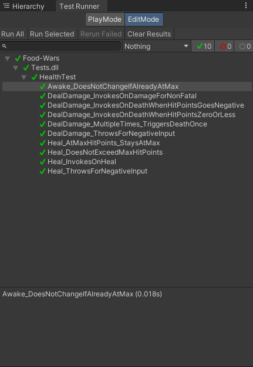

## Context

While I am working on my main project, Food Wars, I found myself hopping into play mode often to quickly test a feature each time I made a change. While this isn't an issue for some of the larger gameplay mechanics (IE: the gun system), doing so for something as trivial as a health system is a bit much. On top of that, I don't have a reference for future changes, and things could break without me even being aware of it.

I have played around with Unit Testing alot during my Embedded Systems Semesters, as that was a required part of the course. However, this was done on Linux (Using WSL), in C, with gcc and make files. A far cry from using Windows, Unity and C#.

Now, I have also done a fair chunk of Unit Testing in C# over the years, under the Embedded course materials. But I didn't exactly know how to do this in **Unity**. Time to rectify that and figure out (Automated) unit testing in Unity.

Unity implements the [NUnit Framework](https://nunit.org/) as their core foundation for running Unit Tests. Luckily, they have made a simple package for import that allows me to get started incredibly quickly with setting up the tests. Once imported, it was a bit of a search to find the correct tab, as the [official reference](https://docs.unity3d.com/Packages/com.unity.test-framework@1.1/manual/index.html) doesn't actually label it well. For those wondering, it can be found under `Windows > General > Test Runner`.

## Setting up the tests

Setting up the test environment itself was fairly easy. In my `Project` tab, I only had to navigate towards the folder where I wanted a **subfolder** to be created for the tests.


This created a `Tests` folder with a relevant `Assembly Definition`. All I needed to do was add the assembly references required for the tests.

And now came the most arduous of tasks, actually writing the tests. While I would usually do this myself, but I decided to test if I could find a way to integrate AI into my workflow. Usually, I've found the code that it produces rather lackluster in both performance and quality. But, considering it's a set of tests for function calls, and their results, it's simple enough to trust an AI model with. That, and I've written **many** tests already at this stage, and I can practically dream their setup.

After feeding it the relevant functions I wanted it to create tests for, alongside which conditions I wanted it to validate, it gave me a series of unit tests which I promptly decided to run.


It did not work.


### Parameter Injection

So, some digging was in order. After taking a peek at the actual tests themselves, those were well outlined and structured clearly. There was nothing wrong with that. So, I opted to check the actual `Setup` and `TearDown` functions. In the `Setup` function, it called a self-made `SetupHealthCompoment` function, which effectively formed entirety of the `Setup` function, aside from instantiating the actual `GameObject` for the `Health Component` to get attached to.

Fairly standard stuff at first, but there was one (Repeated on another parameter as well) line of code that caught my eye:

```csharp
typeof(Health).GetField("MaxHealth", System.Reflection.BindingFlags.NonPublic | System.Reflection.BindingFlags.Instance).SetValue(hm, MaxHealth);
```

At first glance, this looks fine. It uses reflection to try and expose the `MaxHealth` parameter, and set it's value. In most circumstances, that **would** work, and quite frankly, be the perferred method.

But that **field doesn't exist within the health class**.

Quickly adjusting the parameter to point at the **right** field, namely `_maxHitPoints`, fixed it. This was a classic case of the AI hallucinating some details.

While I can respect the use of reflection, it does allow for these minor mistakes to make it through. While I am moderately positive about the outcome in terms of generating the tests, it was subpar due to the aforementioned mistake. I will remedy this by creating my own `Setup` and `Teardown` methods, passing along the note that that aspect has been taken care of. This should avoid the problem in it's entirety, and allow the AI to focus on generating a large range of tests, for each Method/Parameter and case separately.

Running the code now greeted me with this lovely window:


*Nothing quite as satisfying as all tests completed.*

### Asynchronous Code Testing

One last aspect to test before I can conclude this little experiment, is the use of asynchronous code, and how that affects testing. During development, I opt to make use of [UniTask](https://github.com/Cysharp/UniTask), rather than use Unity's built in `Coroutines`. This is primarily due to the garbage collection, but there's enough problems with it that it would warrant an entire post by itself. It's fine for most projects, but I like to go that little step further at no additional cost.

So, to test this, I had to create a mechanic that relied on timing first. As the `Health` script would be used by both player and foe alike, it would be fine to add a regeneration mechanic, that requires an explicit toggle on.

Now, one key issue arrives. While for the most part, asynchronous code follows the same patterns, code that is intended for gameplay does differ in one **key** way in my experience, namely a lack of `Tasks`. These `Tasks` act as the callback (a reminder that the system was busy) for the function, and provide a clean exit point for the function to continue where it left off. That's not exactly the case here, where instead, the system runs in the background occasionally ticking the health value up at it's leisure.

My first attempts left me somewhat confused. I got checkmarks for my tests, meaning that they had successfully completed, but I got an error in the console, meaning they had failed. With that interesting quirk, I opted to increase the delay in one of my tests, to see how that would affect it. Here is one of the tests in question:

```csharp
    [Test]
    public async void Regeneration_WhenDamagedWithRegenerationEnabled_StartsAfterInitialDelay()
    {
        var healthObject = SetupHealthComponent();

        healthObject.EnableRegeneration();
        bool regenerationStarted = false;
        healthObject.OnRegenerationStarted += () => regenerationStarted = true;

        healthObject.DealDamage(50f);

        await UniTask.WaitForSeconds(4.5f);

        Assert.IsTrue(regenerationStarted);
        Assert.IsTrue(healthObject.IsRegenerating);
    }
```

As it turns out, the test itself **ignores** the delay, but the error **is** correctly reported later in the console, by virtue of an assertion error. While serviceable, this does mean staring blankly at the console waiting for an error to arise at any given moment.

With the knowledge that it is in fact, testable, I felt that there was **something** I was missing. Perhaps it was a part of the Unity API, or even UniTask, as the tests would run if I used Coroutines. Digging into the ``README`` file on the UniTask repository, I found a section [dedicated to unit testing](https://github.com/Cysharp/UniTask?tab=readme-ov-file#for-unit-testing). There, I found a function that I honestly had forgotten existed, but nevertheless was incredibly useful: `UniTask.ToCoroutine`. This converts `UniTask` code, and returns it in an `IEnumerator` format, effectively bridging the gap between the two. This would allow me to use some of the IEnumerator asynchronous tests that **Unity** advises using. I had disregarded them up to this point because I wasn't working with IEnumerator objects. With that knowledge, I adapted one of my tests into the following:

```csharp
    [UnityTest]
    public IEnumerator Regeneration_WhenAtFullHealth_DoesNotStart() => UniTask.ToCoroutine(async () =>
    {
        var healthObject = SetupHealthComponent();

        healthObject.EnableRegeneration();
        bool regenerationStarted = false;
        healthObject.OnRegenerationStarted += () => regenerationStarted = true;

        healthObject.DealDamage(0f);

        await UniTask.WaitForSeconds(5f);

        Assert.IsFalse(regenerationStarted);
        Assert.IsFalse(healthObject.IsRegenerating);
    });
```

With the adjustment made, I ran the test on it's own. Unity produced a progress bar and showed a success! After waiting a bit to see if any assertions exceptions would pop up, none did. With that out of the way, I changed over all of my regeneration based tests to use the new system, and ran all the tests. That actually gave me a slow ticking progress bar:


*Turns out, when you do it like this, it actually has a progress bar!*

After about 40 seconds (due to all the required await calls) all tests passed successfully!

### Component Order on RequiredComponent

With that all done as well, I initially laid the testing aside, focussing on the rest of my project. However, at about 12PM, I wondered what the effect would be of one of my favourite Unity Attributes, namely `RequireComponent`. This attribute requires that a component of a certain type, for example, a `Rigidbody`, is present on the object before applying the new component. This negates some very obvious bugs in the first place, such as colliders not being present.

Due to the nature of the script, I opted to assign `Collider` and `Rigidbody` components to this attribute, so that the the object in question can be hit with a bullet. After that, I did wonder how it would impact the tests. To no-one's suprise, it still affects the Unit test. This meant that I would need to add some code for the construction and deconstruction of the components in the right order, as the `Health` component needs to be removed before the other components. With a few tweaks, I got this code working:

```csharp
    private Health SetupHealthComponent()
    {
        _testObject.AddComponent<Rigidbody>();
        _testObject.AddComponent<CapsuleCollider>();
        var healthComponent = _testObject.AddComponent<Health>();

        // Simulate Unity's Awake call
        var awake = typeof(Health).GetMethod("Awake", System.Reflection.BindingFlags.NonPublic | System.Reflection.BindingFlags.Instance);
        awake.Invoke(healthComponent, null);

        return healthComponent;
    }
    [TearDown]
    public void TearDown()
    {
        UnityEngine.Object.DestroyImmediate(_testObject.GetComponent<Health>());

        foreach (var comp in _testObject.GetComponents<Component>())
        {
            if (!(comp is Transform))
            {
                UnityEngine.Object.DestroyImmediate(comp);
            }
        }
    }

```

Now the system can run the tests, despite the aforementioned attribute in place.

## Conclusion

This has been an incredibly insightful side project. I have wondered for a while (but not found the time) to dive into Unit testing within Unity. Now with an excuse to actually do so, I am very pleased with the end result. While I won't apply Unit Tests to every facet of my game, as some system inherently need to be tested manually (Recoil Patterns, Game Feel, Animation...), it will allow me to take some of the basic logic and get that over and done with. Score Systems, Economy Systems and other "Pure Logic" mechanics can easily be tested.

While some of the more technical game systems, such as systems that rely on collisions can **also** be tested, by making use of this function:

```csharp
        var awake = typeof(Health).GetMethod("OnCollisionEnter", System.Reflection.BindingFlags.NonPublic | System.Reflection.BindingFlags.Instance);
        awake.Invoke(healthComponent, null);
```

I do believe that this is still primarily left up to the developer to test manually.

Like I mentioned before, I do believe AI might be of great use in this department, provided I setup the testing methods and give it explicit instructions to only generate tests, or to request me to build functions for it to use in said tests. This should make testing far easier, and allow me to take some of the tedium of testing basic systems out of my workflow. For the most part, I'll be setting up my test-specific code as such:

```csharp
#if UNITY_EDITOR

public void EnableProperty() => Property = true;
public void EnableProperty(var param) => Property = param;

public void SetMethod(var param)
{
    _field = param;
}

#endif
```

Which should hopefully, make my life easier.
